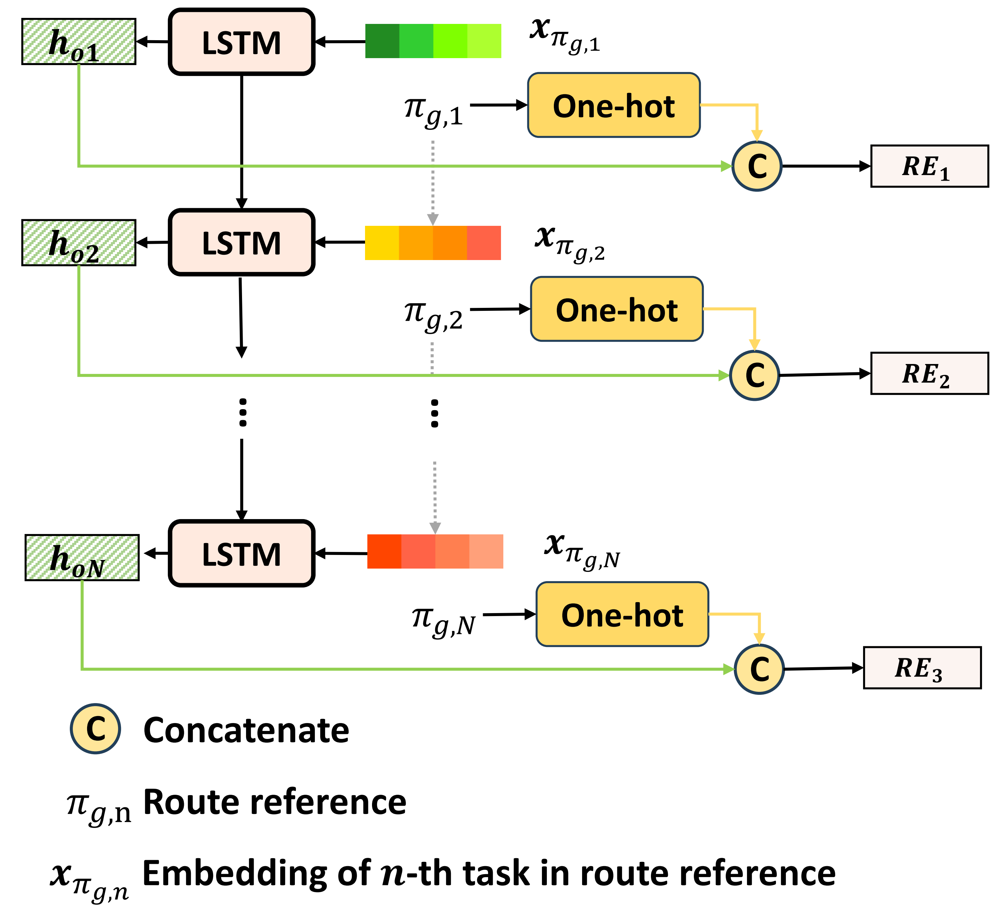
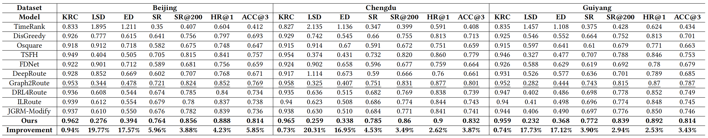
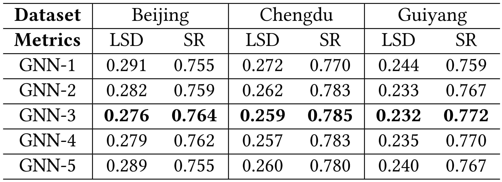
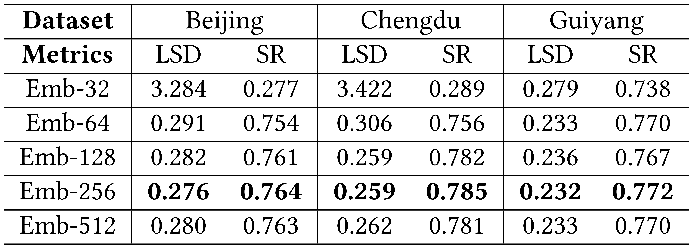
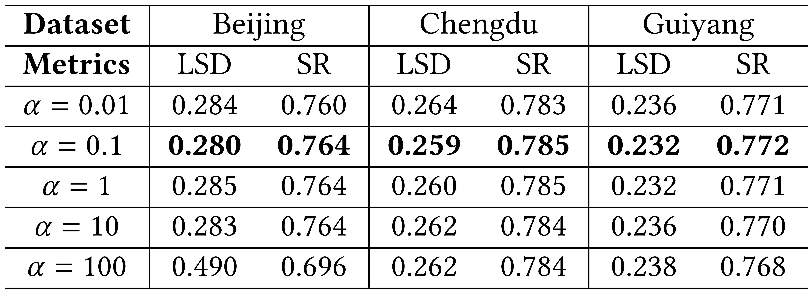

# MRGRP
## Summary


We propose a Multi-Relational Graph-based Route Prediction (MRGRP) method, which enables fine-grained modeling of the correlations among tasks influencing couriers' decision-making and achieves personalized prediction. We encode spatial and temporal proximity, along with the pickup-delivery relationships of tasks, into a multi-relational graph, then design a GraphFormer architecture to capture these complex correlations. Furthermore, we introduce a route decoder that leverages information about couriers as well as dynamic distance and time contexts for personalized prediction. It also utilizes existing route solutions as a reference to find better outcomes.

## Installation

### Environment

- Tested OS: Linux
- Python >= 3.10.0
- PyTorch >= 1.7.0
- hydra == 1.1

### Run

```
python run.py --dataset_name <your_data_folder>
```

## Generation of route reference encoding
We illustrate the process of route reference encoding generation, which is employed in the decoder, as follows.


## Performance
The metrics include KRC, LSD, ED, SR@k, HR@k, ACC@k.KRC, LSD, and ED quantify the similarity between the predicted route and the ground truth from the global perspective, while SR@k, HR@k, and ACC@k measure their local similarity. Higher KRC, HR@k, ACC@k, SR@k, and lower LSD, ED indicate better performance of methods.

<!--  -->


## Hyperparameter study
We illustrate the results of hyperparameter studies as follows. 
### The number of MRGC layers


### Task embedding sizes


### Relative weight of the loss function

From the results, we find that the hyperparameter settings are:
- **\# MRGC Layers**: 3
- **Task embedding sizes**: 256
- **Relative weight**: 0.01

## Notes

The original data is coming soon after undergoing the necessary de-identification and anonymization processes to ensure compliance with privacy regulations and ethical standards.